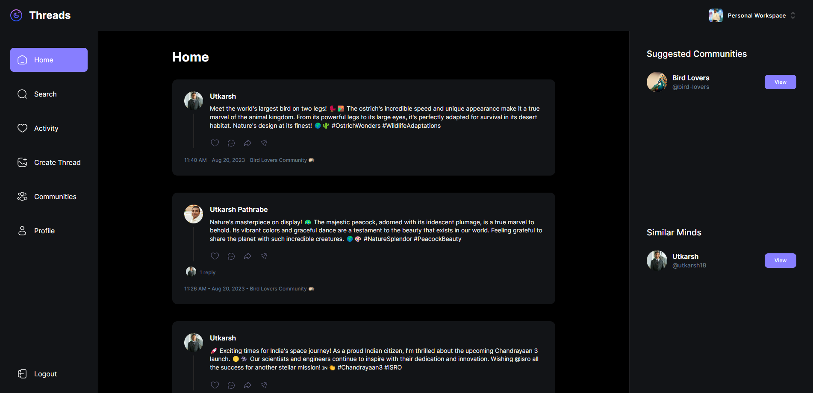

Threads
=======

[Live Website](https://utkarsh-threads.vercel.app/)  

Introducing Threads, a cutting-edge MERN full-stack application that brings seamless communication and collaboration to a new level! 🚀 Built with the powerhouse combo of Next.js, React, TypeScript, and TailwindCSS, Threads offers a sleek and responsive user interface that adapts flawlessly to various devices.  

Harnessing the power of MongoDB, Threads ensures lightning-fast data storage and retrieval, allowing users to seamlessly manage and retrieve information. The integration of Shadcn UI Components adds a touch of sophistication and style to the app's design, delivering a visually appealing and user-friendly experience.  

Catering to modern security needs, Threads employs Clerk Authentication, guaranteeing secure access and protecting user data. The inclusion of UploadThing technology enhances the application's capabilities by enabling smooth and efficient file uploads and sharing.  

Whether it's team collaboration, project management, or staying connected with loved ones, Threads brings together the best of technology and design to offer an unmatched communication experience. Get ready to elevate your online interactions with Threads! 💬  

🌐 #ThreadsApp #MERNStack #InnovationUnleashed  

